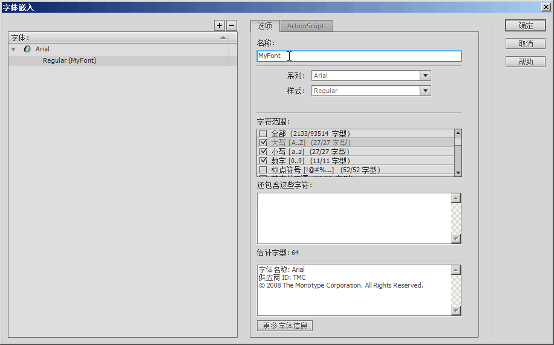
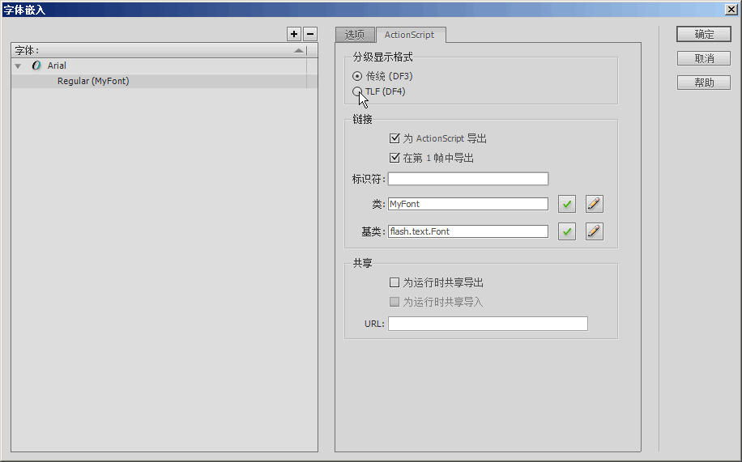

使用Embed标签在AS3项目中嵌入字体

关于嵌入字体，其实[Embed fonts](http://help.adobe.com/en_US/flex/using/WS2db454920e96a9e51e63e3d11c0bf69084-7f5f.html)这篇文章已经很详细的介绍了。但这篇文章有这样几个问题：

1. 它是针对Flex开发者的，纯AS开发者看起来未免不爽；
2. 没有讲解怎么使用在Flash IDE中嵌入的字体；
3. 嵌入字体就那么点东西，其实不值得花功夫读这一大篇鸟语（介是偷懒……）

那我就把要点总结下……<!--more-->

###配合Flash IDE使用

我现在开始讨厌Flash IDE，因为它实在太慢，而且跳版本不兼容。但如果希望可视化的控制嵌入的字体中的文本，还必须使用Flash CS5。

下面是Flash CS5嵌入字体的两张截图。

这个界面很直观，但其实我们可以用更直观的方式（控制unicodeRange的方式，当然，这个“直观”只是对程序员来说），后面会讲到。

图中的“传统”和“TLF”分别对应你的字体是用于TextField还是用于FlashPlayer 10支持的[FTE](http://www.zengrong.net/post/tag/FTE)引擎。这两者是互斥的，不能选错。

如果在输出属性面板中选择的目标是Flash Player 9，那么在这里是不能选择嵌入方式的。

输出后的swf，使用下面的语法嵌入：

	<pre lang="ActionScript">
	[Embed(source="myFont.swf",fontFamily="04b_08"]
	public var myFont:Class;
	</pre>

其中的 `fontFamily`就是双击嵌入的字体打开的的字体预览中显示的全名。例如，微软雅黑的fontFamily的值为 `Microsoft YaHei`。

这里要注意的是，不要使用这种错误的语法来嵌入字体：

	<pre lang="ActionScript">
	[Embed(source="myFont.swf",symbol="MyFont"]
	public var myFont:Class;
	</pre>

这种语法一般会得到一个编译错误，因为 `MyFont`并不是一个Symbol，这种语法只能用于在Flash IDE中导出的MovieClip或者图像、声音等资源。

###在纯AS3项目中嵌入字体

如果你和我一样讨厌Flash IDE的话，那不如直接在AS3代码中嵌入TTF字体好了，语法如下：

	<pre lang="ActionScript">
	[Embed(source="04b_08__.ttf",fontName="04b_08",embedAsCFF="false",unicodeRange="U+0020,U+0041-005A,U+0020,U+0061-007A,U+0030-0039,U+002E,U+0020-002F,U+003A-0040,U+005B-0060,U+007B-007E,U+0020-002F,U+0030-0039,U+003A-0040,U+0041-005A,U+005B-0060,U+0061-007A,U+007B-007E")] 
	public var Font04b08:Class;
	public var myFont:Class;
	</pre>

这一串代码代表的含义是：

使用传统方式（就是上面图2中提到的“传统”）嵌入字体名为`04b_08`的TTF字体中的英文、数字和标点符号，包含大小写。

来看看这四个常用参数的作用吧：

* source		指定要嵌入的字体文件路径。还可以用 `systemFont`指定一个系统中安装的字体。这样的话就可以不需要 `source`参数了。
* fontName		这个实际上就是 `fontFamily` 的别名。
* embedAsCFF	如果不提供这个参数，默认就是true。所以，如果系统你嵌入的字体用于TextField，一定要将其设置为false。
* unicodeRange	要嵌入的文本的范围。见下表：

嵌入字体范围：

* 大写字符		U+0020,U+0041-U+005A
* 小写字符		U+0020,U+0061-U+007A
* 数字			U+0030-U+0039,U+002E
* 标点符号		U+0020-U+002F,U+003A-U+0040,U+005B-U+0060,U+007B-U+007E
* 基本拉丁字符	U+0020-U+002F, U+0030-U+0039, U+003A-U+0040, U+0041-U+005A, U+005B-U+0060, U+0061-U+007A, U+007B-U+007E

当然，还有中文范围等等，详细的可以找到你本机的 `FlexSDK/frameworks/flash-unicode-table.xml` 看看就明白了。还可以参考[Setting character ranges](http://help.adobe.com/en_US/flex/using/WS2db454920e96a9e51e63e3d11c0bf69084-7e04.html)。

那么，怎样制作一个只有嵌入字体数据的swf文件呢？有两种方法：

**第一种**，使用下面的范例代码。下面的代码嵌入了两个字体，使用的范围和上面的例子一样。

有趣的是，如果你**在嵌入字体的这个SWF文件中使用嵌入的字体**（额……我知道有点拗口），你不需要注册这个字体。如果查看注册字体列表，你会发现它已经注册过了。运行下面的代码就知道了。

<pre lang="ActionScript">
package
{
import flash.display.Sprite;
import flash.text.Font;
public class fonts extends Sprite
{
	[Embed(source="04b_08__.ttf",fontName="04b_08",embedAsCFF="false",unicodeRange="U+0020,U+0041-005A,U+0020,U+0061-007A,U+0030-0039,U+002E,U+0020-002F,U+003A-0040,U+005B-0060,U+007B-007E,U+0020-002F,U+0030-0039,U+003A-0040,U+0041-005A,U+005B-0060,U+0061-007A,U+007B-007E")] 
	public var Font04b08:Class;
	[Embed(source="Frabk.ttf",fontFamily="Franklin Gothic Book",embedAsCFF="false",unicodeRange="U+0020,U+0041-005A,U+0020,U+0061-007A,U+0030-0039,U+002E,U+0020-002F,U+003A-0040,U+005B-0060,U+007B-007E,U+0020-002F,U+0030-0039,U+003A-0040,U+0041-005A,U+005B-0060,U+0061-007A,U+007B-007E")] 
	public var FontFrabk:Class;

	public function fonts()
	{
		var __fontArr:Array= Font.enumerateFonts(false);
		//Font.registerFont(myFont);
		for each(var __font:Font in __fontArr)
			trace(__font.fontName, __font.fontType);
	}
}
}
</pre>

**第二种**，使用Flex SDK提供的fontswf工具，这个工具位于 `FlexSDK/bin`文件夹下，是JAVA开发的命令行工具。具体用法和参数与Embed类似，看[Using the fontswf utility](http://help.adobe.com/en_US/flex/using/WS2db454920e96a9e51e63e3d11c0bf69084-7f5f.html#WS02f7d8d4857b16776fadeef71269f135e73-8000)就清楚了。

###载入外部的字体文件

当然，你不应该载入ttf文件。应该先使用上面介绍的方法把字体做成swf文件，然后载入。

使用Loader载入外部的swf文件后，需要获取到该swf中嵌入的字体的Class，然后使用 `Font.registerFont` 注册这个字体，注册成功后就可以使用了。

获取swf中嵌入的字体的Class，也有两种方法：

**第一种**，载入成功后，使用Loader.content获取到载入的swf的root，然后直接通过该swf中定义的public变量获取到类定义：

<pre lang="ActionScript">
	var __font:* = _loader.content;
	trace('04b08:', __font.Font04b08);

	Font.registerFont(__font.Font04b08);
	Font.registerFont(__font.FontFrabk);
</pre>

**第二种**，载入成功后，使用 `ApplicationDomain.getDefinition` 获取嵌入的字体类，类的名称是“源文件类名_嵌入目标变量名称”：

<pre lang="ActionScript">
	var __fontClass:Class = _loader.contentLoaderInfo.applicationDomain.getDefinition("fonts_Font04b08") as Class;
	trace('class:',__fontClass);
	Font.registerFont(__fontClass);
</pre>

在使用外部字体swf文件的时候，如果自身又被另一个swf载入，情况就变得非常复杂，需要设置应用程序域和系统安全域。简单的说，就是要遵循以下两条原则：

<pre lang="ActionScript">
	//如果自己被父SWF载入，那么应用程序域就必须设置成当前域或者是子域才行
	var __loaderContext:LoaderContext = new LoaderContext(true, ApplicationDomain.currentDomain);
	_loader.load(new URLRequest('fonts_local.swf'),  __loaderContext);

	//如果载入的字体swf与发起载入的swf不在一个网域，就需要将安全域设定为当前安全域
	var __loaderContext:LoaderContext = new LoaderContext(true, ApplicationDomain.currentDomain, SecurityDomain.currentDomain);
	_loader.load(new URLRequest('fonts_local.swf'),  __loaderContext);
</pre>

但是，如果子域和父域有同名包、同名类、同名方法，那么就要注意了，使用当前应用程序域或者子域会让你程序的结构变得一团糟，甚至可能会产生命名空间冲突。而这种冲突给出的运行时错误提示基本让你没法查出错误在哪里。

要理解这块的纠结之处，最好的办法是下载我的范例程序自已调试把！

* [纯AS3项目嵌入字体的范例](as3_embed_font/fonts.7z)

* [纯AS3项目载入嵌入字体swf的范例](as3_embed_font/LoadEmbedFont.7z)

